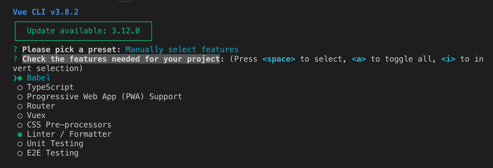

* Vue CLI 的包名称由 vue-cli 改成了 @vue/cli。 如果你已经全局安装了旧版本的 vue-cli (1.x 或 2.x)，你需要先通过 npm uninstall vue-cli -g 或 yarn global remove vue-cli 卸载它。

* Node版本
Vue CLI 需要 Node.js 8.9 或更高版本 (推荐 8.11.0+)。

* 安装 

```

npm install -g @vue/cli

vue --version   # 查看版本，检查是否安装成功
```

* 在终端中创建项目

```

vue create hello-world
```

输入创建命令后，提示 `Please pick a preset`


1. default表示默认的，我们选择Manually select features，手动选择需要的features

2. Check the features needed for your project



选择以下勾选的特性


Use history mode for router？我们选择y


选择css预处理器 dart-sass

  

选择eslint配置 （ESLint + Prettier）

 

什么时候lint,选择保存的时候lint校验

 

配置写在一个独立文件还是写在package.json文件中,选择独立的配置文件vue.config.js

 

是否保存配置


* 初始化项目


* 启动项目
```
cd hello-world

npm run serve
```

启动成功后


在浏览器中打开

