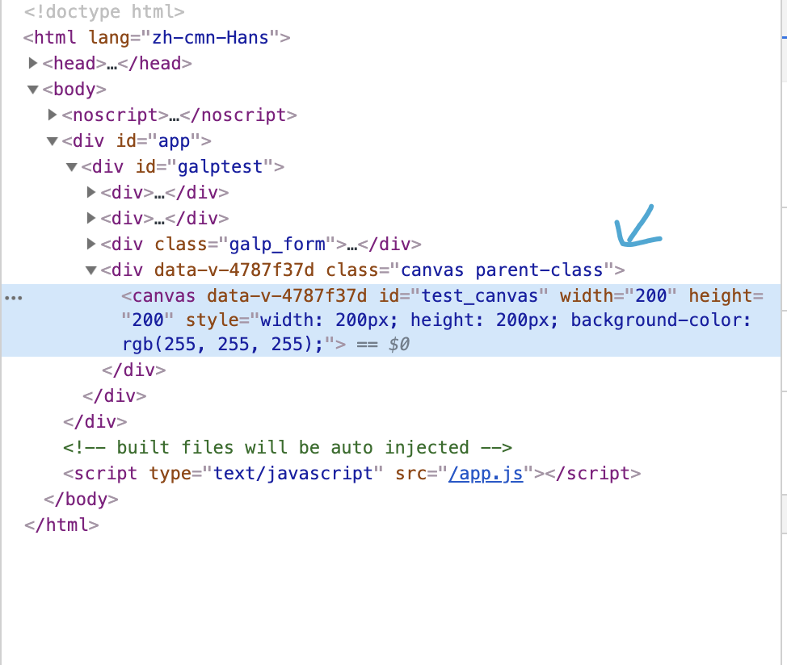

项目目录

项目已经搭建完成

## 增加一个页面，以水质管理为例：

* 在views下新建一个waterManagement文件夹，新建一个Index.vue,用于承载整个页面结构，

Index.vue文件内容：

* 新建页面左侧子菜单的组件waterMenu.vue

* 编写子菜单的‘概览’子页面,新建general目录，新建Index.vue组件用于承载子页面布局

Index.vue内容：

* 编写general‘概览’子页面的业务组件：

除了Index.vue之外的组件，都是这个页面拆分开的业务组件，在业务组件内分别写各自的交互和业务.最终都在Index.vue中引入。

如页面上的‘当日用水量’组件（dayChartBox.vue）：

代码如下：

如图,loadChart1方法就是这个组件内的主要业务，由于这个业务是这个页面特有的，所以这个组件就是业务组件，无法复用。
而图中，还引入了一个BoxTitle的组件，这个组件是可以复用的，因为这个组件内没有特殊业务，唯一提供的外部接口是标题文字。使用的时候传入name属性就可以。

添加一个页面的整个流程大概就是这样。

## vuex
vuex作为状态管理，能取代大部分组件之间的通信。完成一个最简单的父子组件通信需要props和$emit两个方法，如果是兄弟组件，那么用props和$emit需要通过兄弟组件的父组件来做桥梁，如果是一个组件和他的子组件的子组件进行通信，那这个代码更复杂。而用vuex只需要‘this.$store.getters.xxx’和‘this.$store.dispatch（xxx,xxxx）’两句代码，可以跨域整个项目的所有组件，组件之间的通信就变得简单了。

这两种方式都有优缺点，一般的组件通信就直接用props就可以了，vuex管理的状态基本上是跨越整个项目的，在非常多的组件中都会用到。

在这个项目中，vuex结合了sessionStorage和localStorage进行持久化。在App.vue组件中进行了页面刷新后的vuex初始化,包括了token.

## axios

这个项目中，没有在每个组件中直接用axios进行网络请求。在项目的Utils目录下有个http.js文件，封装了axios的一下配置。如请求头设置，请求拦截，响应拦截和各种请求方法等。

使用的时候不用管axios如何配置和封装，只需要调用http.js中封装的各种请求方法，如get,post,fileUpload等。

但是接口是可能经常变化的，为了容易维护，一般在组件和http.js之间还封装了一层业务层面上的接口调用。

在项目目录下的api目录下，编写的是对后端接口的调用。

axios  qs  
ajax请求的get请求是通过URL传参的（以？和&符连接），而post大多是通过json传参的。
qs是一个库。里面的stringify方法可以将一个json对象直接转为(以?和&符连接的形式)。
在开发中，发送请求的入参大多是一个对象。在发送时，如果该请求为get请求，就需要对参数进行转化。使用该库，就可以自动转化，而不需要手动去拼接

## echarts

这个项目中，大量使用到了图表的功能。图表的使用方式不难，主要是配置繁琐。可以参考官方的配置文档说明。

在项目中使用的时候尽量不要在组件中直接进行图表的配置。尽量单独用一个文件来配置，容易维护和简单的封装（个人觉得图表没必要深度封装，成本太高，还不如直接拷贝代码修改，视项目具体情况而定）

## 组件样式

在自定义组件上使用class属性时，不会覆盖组件根元素的class.

实际生成的元素class是这样的

在element-ui元素使用的时候如果因为css优先级的原因无法修改样式，可以尝试 !important 

## vs code调试vue项目

在项目根目录下的vue.config.js中添加：

在babel.config.js中添加：

安装Debugger for Chrome插件
在debug中添加配置：

